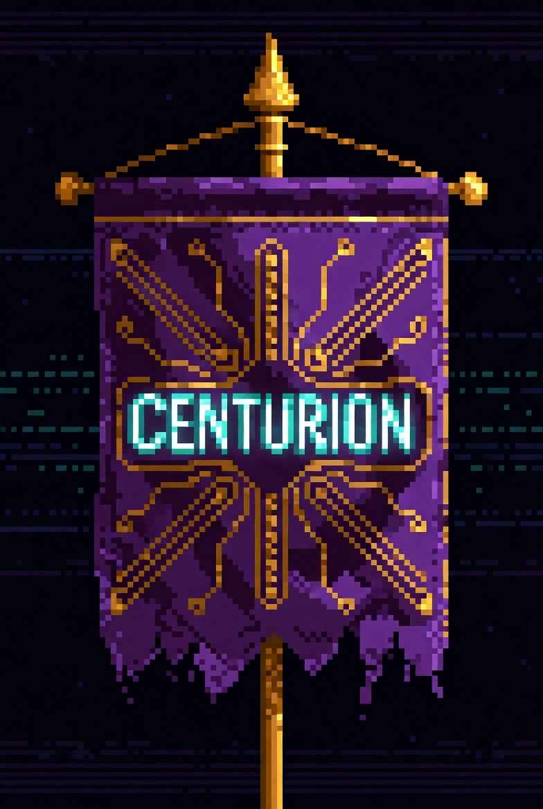

# ⚔️ CENTURION — Commander of the AI Legion

<div align="center">




**The Autonomous AI Orchestration Framework**
*Inspired by Shannon. Built for OpenClaw.*

*ACTA, NON VERBA* (Deeds, not words)

</div>

## 🏛️ What is CENTURION?

CENTURION transforms your AI coding assistant into a disciplined **Roman Legion**.
Instead of a generic chatbot, you command an elite squad of specialized agents that **verify their own work**.

### 🛡️ The Doctrine: PROBATIO (Proof)
We moved beyond "Chat". We moved to **Action**.
Every Legionary follows the **Shannon Cycle**:
1.  **Recon:** Understand the environment.
2.  **Action:** Write code / Execute attack.
3.  **Probatio:** **VERIFY** the result (Run tests, Curl localhost, Check exploit).
4.  **Report:** Only report success if proof exists.

---

## 🦅 The Legion (Elite 11)

### 🏗️ Cohors Prima (Builders & Support)
| Legionary | Role | Probatio (Verification) |
| :--- | :--- | :--- |
| **OPTIO** | **Commander.** Orchestrates & Plans. | Verifies all sub-agent reports. |
| **CODER** | **Builder.** Code & Refactoring. | **Must run Unit Tests.** |
| **PONTIFEX** | **Engineer.** DevOps & Docker. | **Must Curl/Healthcheck services.** |
| **EXPLORATOR**| **Scout.** Research & Web. | **Must verify links & sources.** |
| **DEBUGGER** | **Medic.** Bug fixer & Log analyst. | **Must reproduce bug -> fix -> verify fix.** |
| **TESTER** | **Tester.** QA & E2E tests. | **Must produce a passed test report.** |
| **GUARDIAN** | **Shield.** Security & Dependency. | **Must audit `npm audit` / dependencies.** |
| **LIBRARIUS** | **Scribe.** Docs & Memory. | **Must verify doc links and consistency.** |

### ⚔️ Cohors Ferrata (Security Elite)
*Advanced Security Suite*

| Legionary | Role | Function |
| :--- | :--- | :--- |
| **VELITES** | **Recon.** | Active Port Scanning & Tech Stack mapping. |
| **HARUSPEX** | **Analyst.** | Source Code Analysis (SAST) for vulnerabilities. |
| **SICARIUS** | **Assassin.** | Browser-based Exploit Verification (DAST). |

---

## 🧠 BATTLE PROTOCOLS

### 📜 PROBATIO PROTOCOL
**Trigger:** Always active.
**Action:** No task is complete without proof.
*   *Coder:* "I wrote the function AND ran `test.py`. It passed."
*   *Pontifex:* "I deployed Docker AND curled port 3000. It returns 200 OK."

### 🦅 VIRTUS (Super Mode)
**Trigger:** `Virtus!` command.
**Action:**
1.  **Nulla Remissio:** Zero laziness.
2.  **Ratio Maxima:** Deep Chain of Thought.
3.  **Veritas Absoluta:** Fact-checking via Context7.

---

## 🚀 Installation

### 1. Clone & Install
```bash
git clone https://github.com/mrzlab630/centurionCLI.git
cd centurionCLI && bash install.sh
```

### 2. Usage
```bash
claude
```

---

*Built with the precision of a Roman Legion.*
