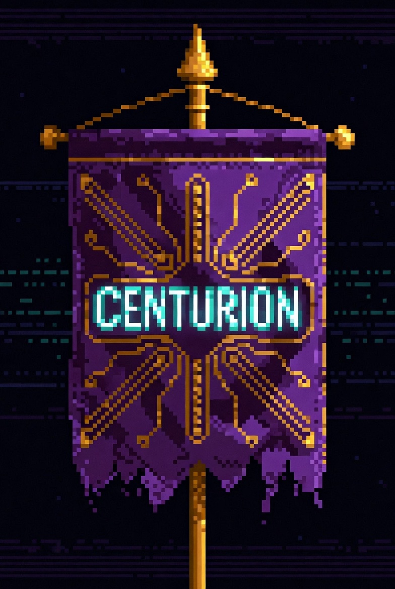

# CENTURION — Commander of the AI Legion

<div align="center">




**A Roman-legion orchestration framework for AI coding agents**

*DISCIPLINA ET FIDES*

</div>

---

## What Is CENTURION?

CENTURION turns a coding agent into a disciplined Roman Legion of specialized
skills. Each Legionary has a role, activation rules, tools, and proof standards.
Cohors Secunda v2.1 keeps one canonical active Legion skill surface in
`~/.agents/skills` and leaves Codex system skills in `~/.codex/skills/.system` to
avoid duplicate skill names and context bloat.

### Key Features

- **37 Legionaries** across command, build, product/UX, quality, intel, growth, ops, and Ferrata security cohorts.
- **Canonical skill surface** — Legion skills live in `~/.agents/skills`; duplicate copies are not installed into `~/.codex/skills`.
- **Mission preparation tooling** — OPTIO routes primary and adjacent Legionaries with `mission-prep.mjs`.
- **Context governance** — CURATOR audits active skills for duplicate names, drift, long descriptions, and heavy skill bodies.
- **Eval gate** — TESTER runs a deterministic Legion smoke eval that checks routing, GUARDIAN risk gating, and duplicate-free skill names.
- **MEMORIA v1.2.0** — semantic memory MCP server with local embeddings.
- **PROBATIO doctrine** — every material task requires proof: facts, tests, logs, diffs, scans, or live checks.
- **Antigravity Legion Kit** — portable Google Antigravity IDE and `agy` CLI integration under `integrations/antigravity-legion-kit`.

---

## The Legion

### Core 8

| Legionary | Skill | Role |
| :--- | :--- | :--- |
| **OPTIO** | `/orchestrator` | Commander. Plan, interpret, route tasks. |
| **CODER** | `/coder` | Builder. Production code implementation and focused fixes. |
| **DEBUGGER** | `/error-handler` | Medic. Errors, logs, incidents, data. |
| **EXPLORATOR** | `/researcher` | Scout. Codebase, documentation, web research. |
| **PONTIFEX** | `/pontifex` | Engineer. Docker, CI/CD, PostgreSQL, infra. |
| **TESTER** | `/tester` | QA. Tests, coverage, evals, regression gates. |
| **GUARDIAN** | `/security` | Shield. OWASP, secrets, dependencies, supply chain. |
| **LIBRARIUS** | `/planner` | Scribe. Plans, TODOs, project knowledge. |

### Specialist Cohorts

| Cohort | Legionaries |
| :--- | :--- |
| Command | CAPABILITIES, CURATOR, PRAEMONITOR, SKILL-QUARTERMASTER |
| Build | ARCHITECTUS, ARTIFEX, DOCUMENTER, PICTOR, PRAECO, REFACTORER |
| Product/UX | LUDIFEX, AEDILIS, NOMENCLATOR, GLOSSATOR |
| Quality | CENSOR, REVIEWER |
| Intel | AUGUR, QUAESTOR, TABULARIUS |
| Growth | ALEATOR, INDAGATOR, MERCATOR, ORATOR |
| Ops | EVOCATUS, SIGNIFER |
| Ferrata | VELITES, HARUSPEX, SICARIUS |
| Prompt | INTERPRES (`prompt-engineer`) |

---

## Field Doctrine

### Legion Field Cycle

1. **Praeparatio** — identify needed capability and local skills.
2. **Dispositio** — route by hierarchy: OPTIO, EXPLORATOR, CODER, TESTER, REVIEWER, GUARDIAN, CURATOR.
3. **Actio** — execute in small handoffs with objective, files, proof, and adjacent calls.
4. **Probatio** — verify with tests, logs, scans, source citations, or live checks.
5. **Disciplina** — retain compact lessons without bloating global memory.

### Battle Protocols

| Protocol | Trigger | Purpose |
| :--- | :--- | :--- |
| **VIRTUS** | `Virtus!` or high-risk work | Deep verification mode. |
| **WAR ROOM** | `/war-room "Topic"` | Prosecutor/Advocate/Judge debate. |
| **CENSOR** | `/censor` or review work | Adversarial verification. |
| **PROBATIO** | Always active | Evidence before completion. |
| **CODE MODE** | Repetitive/bulk work | Use deterministic local scripts. |

---

## Skill Surface Tools

Run from a checkout or an installed skill root:

```bash
CENTURION_SKILLS_ROOT="${CENTURION_SKILLS_ROOT:-$PWD/skills}"
node "$CENTURION_SKILLS_ROOT/context-optimizer/scripts/skill-surface-audit.mjs"
node "$CENTURION_SKILLS_ROOT/context-optimizer/scripts/skill-drift-report.mjs"
node "$CENTURION_SKILLS_ROOT/tester/scripts/legion-skill-eval.mjs"
```

Expected active-surface invariants:

```text
duplicateNameCount: 0
driftedDuplicateCount: 0
longDescriptions: [] for non-system skills
```

---

## MEMORIA

Built-in MCP server for persistent semantic memory across conversations.

- **Model:** nomic-embed-text-v1.5 compatible local embeddings.
- **Storage:** JSON persistence with indexed chunks.
- **Tools:** `memory_search`, `memory_store`, `memory_forget`, `memory_list`, `memory_reindex`, `memory_status`.

---

## Antigravity Integration

`integrations/antigravity-legion-kit` preserves the Antigravity-facing CENTURION pack in this repository. It contains IDE rules, workflows, compact skill briefs, an `agy` CLI plugin, a local MCP bridge, catalog refresh scripts, frontend/reference/content catalogs, and the guarded `AUXILIUM AGY` delegation protocol.

Start here:

```bash
cd integrations/antigravity-legion-kit
node ./scripts/smoke.mjs
node ./installer/install.mjs --dry-run
```

See [docs/ANTIGRAVITY_LEGION_KIT.md](docs/ANTIGRAVITY_LEGION_KIT.md) for install, validation, and maintenance rules.

---

## Installation

```bash
git clone https://github.com/mrzlab630/centurionCLI.git
cd centurionCLI
git checkout cohors-secunda
chmod +x install.sh
./install.sh
```

### Prerequisites

- Node.js >= 20
- Claude Code CLI for legacy MCP registration through `claude mcp add`
- Python 3 for Ferrata helper scripts

### API Keys

Set optional keys in your shell profile before running `install.sh`:

```bash
export BRAVE_API_KEY="your_key"
export GITHUB_PERSONAL_ACCESS_TOKEN="ghp_x"
export PERPLEXITY_API_KEY="pplx-x"
```

### What `install.sh` Does

1. Checks prerequisites.
2. Backs up existing Claude configuration.
3. Installs `CLAUDE.md`, doctrine docs, scripts, pipeline templates, and shared libs.
4. Deploys all 37 Legion skills to `~/.agents/skills`.
5. Keeps Codex system skills in `~/.codex/skills/.system` and avoids Legion duplicates in `~/.codex/skills`.
6. Builds MEMORIA and registers MCP servers when possible.
7. Runs the Legion skill eval when installed.

---

## Directory Structure

```text
centurionCLI/
├── CLAUDE.md              # Global Centurion instructions
├── FERRATA.md             # Offensive security doctrine
├── PROBATIO.md            # Proof protocol standards
├── README.md              # This file
├── install.sh             # Installer
├── docs/                  # Operator docs, including Antigravity kit guidance
├── integrations/          # External product integrations
├── libs/                  # Shared libraries
├── scripts/               # Utility scripts
├── pipeline/              # Handoff templates
├── mcp-servers/memoria/   # Semantic memory MCP server
├── skills/                # 37 canonical Legionary modules
└── logo/                  # Branding assets
```

---

## Version History

| Version | Codename | Legionaries | Highlights |
| :--- | :--- | :--- | :--- |
| 1.0 | Cohors Prima | 8 | Core legion, PROBATIO doctrine |
| 1.5 | Cohors Ferrata | 11 | Velites, Haruspex, Sicarius |
| 2.0 | Cohors Secunda | 27 | Full roster, MEMORIA, WAR ROOM, AGMEN |
| **2.1** | **Cohors Secunda** | **37** | **Canonical `.agents` skill surface, specialized Product/UX Legionaries, mission-prep, skill audit/eval, duplicate-name guard** |

---

<div align="center">

**⚔️ DISCIPLINA ET FIDES**

</div>
